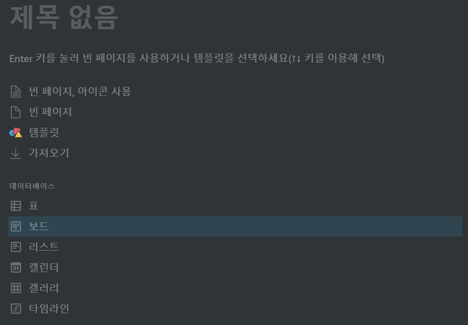
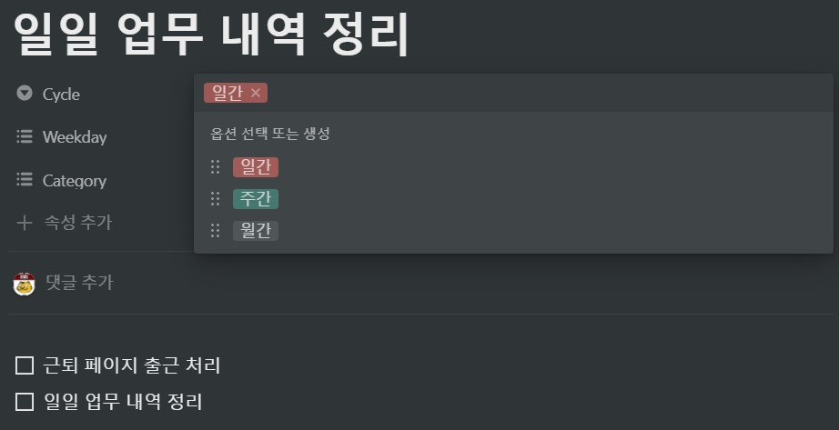
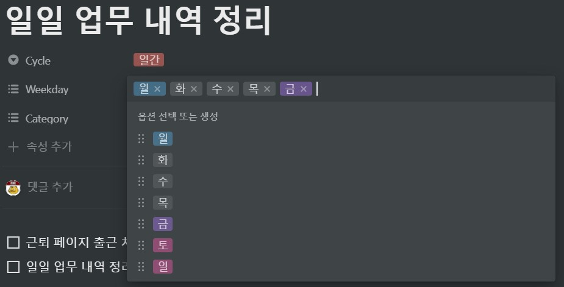
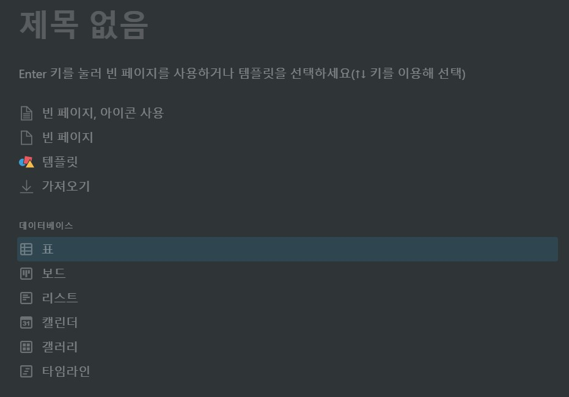
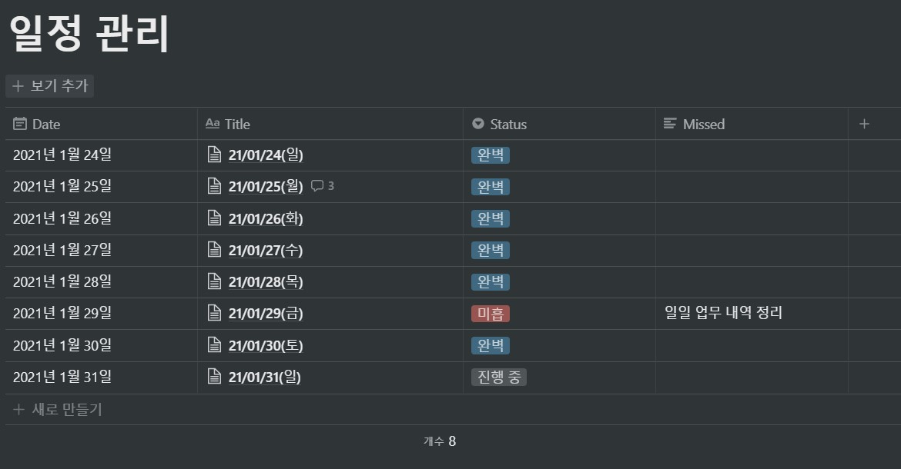
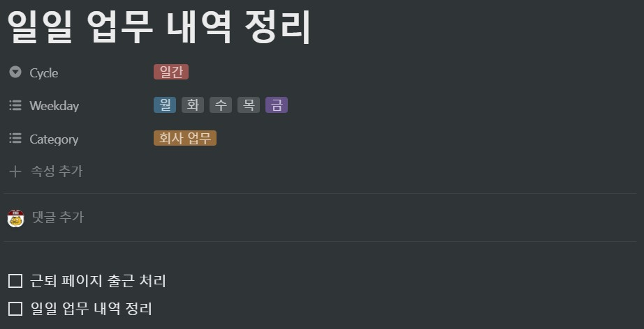

선행 요구 사항

※ 2021/01/31 현재는 일간 체크리스트에 대한 기능만 구현되어 있습니다. 주간/월간은 지원하지 않습니다.

* **반복성 작업**을 저장할 **칸반 보드**만 존재하는 페이지 블록 _(주소 복사 필요)_
  * Cycle(선택), Weekday(다중 선택) 속성이 반드시 존재해야 함

* **일일 체크리스트**를 저장할 **표 데이터베이스**만 존재하는 페이지 블록 _(주소 복사 필요)_
  * Date(날짜), Title(텍스트), Status(선택) 속성이 반드시 존재해야 함

사용 방법
1. 선행 요구사항에서 만든 칸반 보드에 일일 체크리스트 항목을 추가
    * Cycle을 일간으로 선택
    * Weekday에서 해당 티켓이 수행되어야 할 요일을 모두 선택
    * 최상위 항목은 반드시 할 일 블록이어야 함

2. python3 DailyChecklistManager.py [-m update,U | add,A] [-t token_v2] [-uc 체크리스트 페이지의 url] [-ur 칸반 보드 페이지의 url]
    * python3 DailyChecklistManager.py -m A -t ~ -uc ~ -ur ~ : 일일 체크리스트 추가. 매일 자정에 스케줄러 등록을 권장합니다.
    * python3 DailyChecklistManager.py -m U -t ~ -uc ~ -ur ~ : 당일 체크리스트 상태 갱신. 매 시간 스케줄러 등록을 권장합니다.
